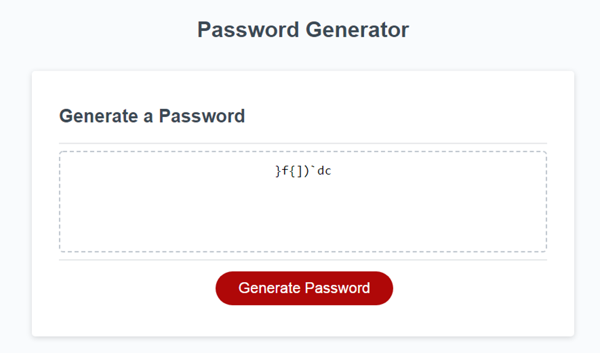

# Password Generator Challenge #3

## Description
The purpose of this project is to provide greater security by building a password generator that creates strong passwords, depending on the criteria selected. It allows you to choose the length of the password (from 8 to 128) and character types. 

## Built With
- HTML
- CSS
- JavaScript

## Website
https://lizariasc.github.io/password-generator/

## Mock up of the Website

## Website functionality example when choosing 8 characters of length 
 

## Contrubution
Liz Arias.